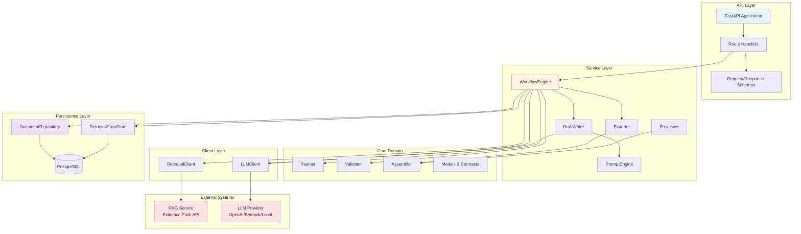
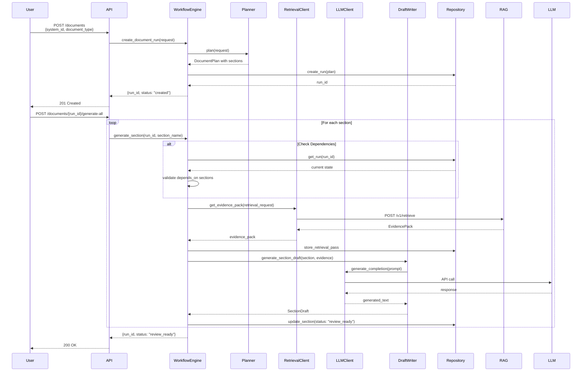
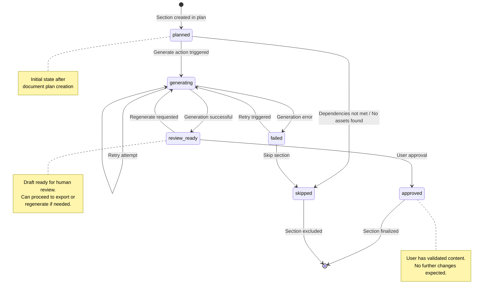
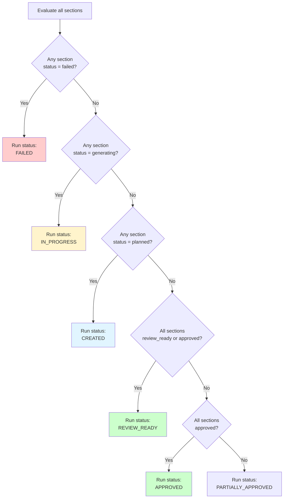
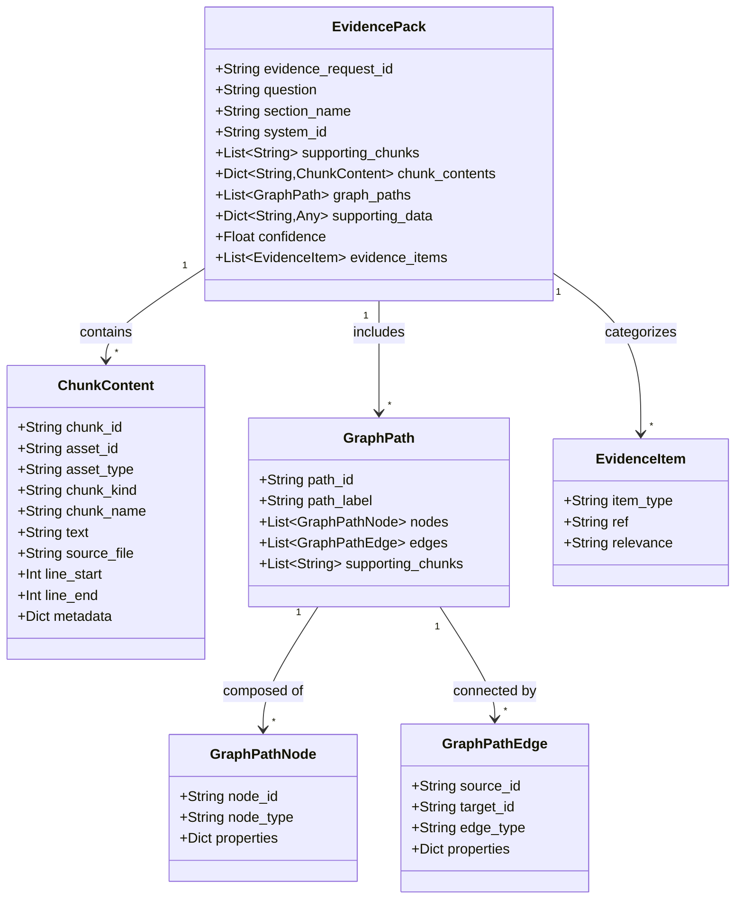
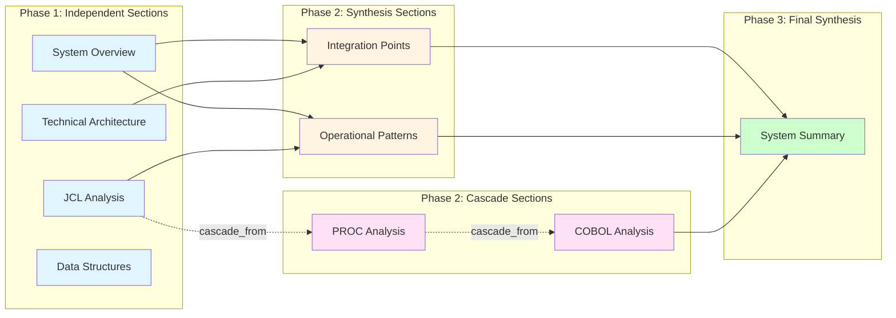
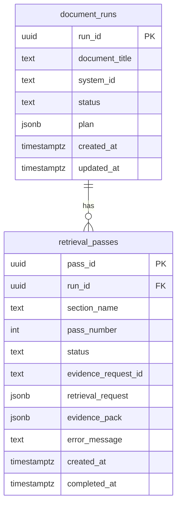
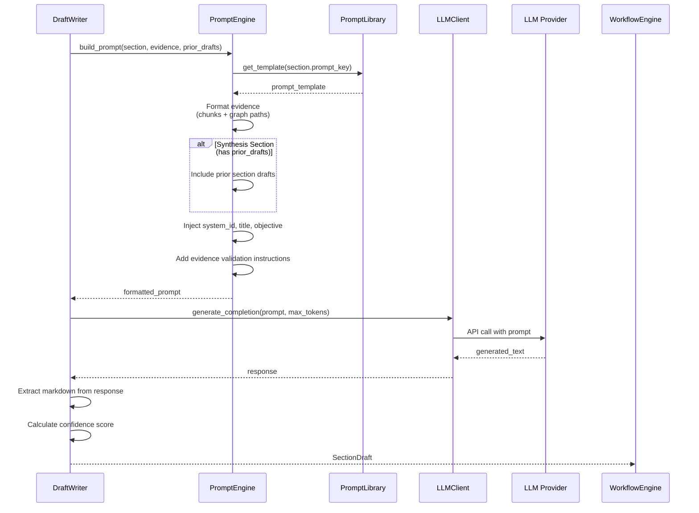

# Architecture Diagrams

Visual documentation of the Mainframe Document Orchestrator system architecture, data flow, and process workflows.

---

## 1. System Architecture Overview



**Key Components:**
- **API Layer**: FastAPI endpoints, request validation, response serialization
- **Service Layer**: Orchestration, content generation, export/preview logic
- **Core Domain**: Business logic (planning, validation, assembly)
- **Client Layer**: Adapters for external services
- **Persistence**: Postgres repositories for state management
- **External Systems**: RAG evidence service and LLM providers

---

## 2. Document Generation Flow



---

## 3. Section State Machine



**State Transitions:**
- `planned` → `generating`: When generate_section() is called
- `generating` → `review_ready`: Successful draft generation
- `generating` → `failed`: LLM error, timeout, or validation failure
- `review_ready` → `approved`: User explicitly approves section
- `review_ready` → `generating`: User requests regeneration
- `failed` → `generating`: Retry with same or modified parameters
- Any → `skipped`: Cascade sections with no upstream assets

---

## 4. Document Run Status Derivation



---

## 5. Retrieval Request Building

```mermaid
flowchart TD
    Start[Section requires generation] --> CheckCascade{Section has<br/>cascade_from?}
    
    CheckCascade -->|Yes| ExtractAssets[Extract discovered_asset_ids<br/>from upstream sections]
    ExtractAssets --> CheckAssetsFound{Asset IDs found?}
    
    CheckAssetsFound -->|No| SkipRetrieval[Skip retrieval<br/>Set status: review_ready<br/>with skip note]
    CheckAssetsFound -->|Yes| BuildFilters[Build RetrievalFilters<br/>with asset_ids]
    
    CheckCascade -->|No| CheckAssetFilter{Section has<br/>asset_type_filter?}
    CheckAssetFilter -->|Yes| BuildTypeFilters[Build RetrievalFilters<br/>with asset_types]
    CheckAssetFilter -->|No| NoFilters[Build RetrievalFilters<br/>empty = no constraints]
    
    BuildFilters --> CreateRequest[Create RetrievalRequest]
    BuildTypeFilters --> CreateRequest
    NoFilters --> CreateRequest
    
    CreateRequest --> CheckExisting{Crash recovery:<br/>completed pass exists?}
    
    CheckExisting -->|Yes| FetchExisting[GET /v1/evidence-packs/{id}]
    CheckExisting -->|No| NewRetrieval[POST /v1/retrieve]
    
    FetchExisting --> ProcessEvidence[Process EvidencePack]
    NewRetrieval --> StorePass[Store retrieval pass] --> ProcessEvidence
    
    ProcessEvidence --> GenerateDraft[Generate section draft]
    
    SkipRetrieval --> End[Return section result]
    GenerateDraft --> End

    style SkipRetrieval fill:#ffffcc
    style ProcessEvidence fill:#ccffcc
```

---

## 6. Evidence Pack Structure



---

## 7. Dependency Chain Resolution



**Legend:**
- **Blue**: Phase 1 - Independent retrieval sections
- **Yellow**: Phase 2 - Synthesis sections (require upstream drafts)
- **Pink**: Phase 2 - Cascade sections (require upstream asset IDs)
- **Green**: Phase 3 - Final synthesis
- **Solid arrows**: `depends_on` relationship
- **Dotted arrows**: `cascade_from` relationship

---

## 8. Database Schema



**Key Relationships:**
- One document run can have multiple retrieval passes
- Each retrieval pass tracks evidence gathering for one section
- Pass numbers increment for retries/regenerations
- Evidence pack stored as JSONB for easy querying

---

## 9. API Request Flow

```mermaid
flowchart TD
    Start[Client Request] --> Router{Route}
    
    Router -->|POST /documents| CreateRun[create_document_run]
    Router -->|POST /documents/{id}/generate-all| GenAll[generate_all_sections]
    Router -->|POST /documents/{id}/sections/{name}| GenOne[generate_section]
    Router -->|GET /documents/{id}| GetDoc[get_document_run]
    Router -->|GET /documents/{id}/sections/{name}| GetSec[get_section]
    Router -->|POST /documents/{id}/approve| Approve[approve_document]
    Router -->|GET /documents/{id}/export| Export[export_document]
    
    CreateRun --> Deps[Dependency Injection]
    GenAll --> Deps
    GenOne --> Deps
    GetDoc --> Deps
    GetSec --> Deps
    Approve --> Deps
    Export --> Deps
    
    Deps --> WE[WorkflowEngine]
    Deps --> Repos[Repositories]
    Deps --> Clients[External Clients]
    
    WE --> Process[Process Request]
    Process --> DB[(PostgreSQL)]
    Process --> RAG[RAG Service]
    Process --> LLM[LLM Provider]
    
    Process --> Response[Format Response]
    Response --> Client[Return to Client]

    style Start fill:#e1f5ff
    style Router fill:#fff4e1
    style WE fill:#ffe1e1
    style Response fill:#ccffcc
```

---

## 10. Prompt Engineering Flow



---

## Diagram Usage Guide

| Diagram | Use When |
|---------|----------|
| **System Architecture** | Understanding component relationships and responsibilities |
| **Document Generation Flow** | Tracing end-to-end request processing |
| **Section State Machine** | Understanding section lifecycle and valid transitions |
| **Document Run Status** | Debugging status calculation issues |
| **Retrieval Request Building** | Understanding cascade logic and asset filtering |
| **Evidence Pack Structure** | Working with retrieval responses |
| **Dependency Chain** | Planning section generation order |
| **Database Schema** | Writing queries or migrations |
| **API Request Flow** | API integration or debugging |
| **Prompt Engineering Flow** | Debugging generation or prompt issues |

---

## Related Documentation

- [REPO_STRUCTURE.md](./REPO_STRUCTURE.md) - Code organization
- [API.md](./API.md) - API endpoints and examples
- [BUILD_ORDER.md](./BUILD_ORDER.md) - Development sequence
- [PERSISTENCE.md](./PERSISTENCE.md) - Database design
- [MODEL_PORTABILITY.md](./MODEL_PORTABILITY.md) - LLM provider switching
